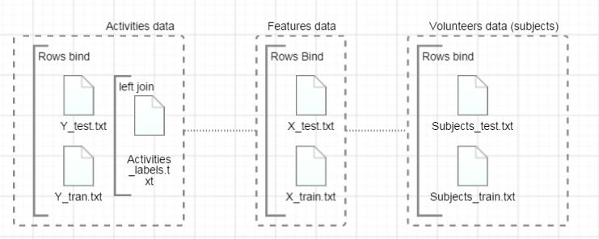

UCI HAR Datasets cleaning & processing 
==================================
This is a [assignment](https://www.coursera.org/learn/data-cleaning/peer/FIZtT/getting-and-cleaning-data-course-project) project,and aims to demonstrate how to get and clean  the data to be ready for further analysis, giving raw datasets about human activities recorded by smartphone "accelerometer & gyroscope" sensors, this code will clean and process these sets onto one tidy dataset , for more information about this [experimiets and the source Dataset description-link](http://archive.ics.uci.edu/ml/datasets/Human+Activity+Recognition+Using+Smartphones).


There are three folders inside this project:

- **R** 
...for R code and contains only one file "run_analysis.R"
- **data-raw**
...contain extracted raw data sets ([donwloaded from UCI site](https://d396qusza40orc.cloudfront.net/getdata%2Fprojectfiles%2FUCI%20HAR%20Dataset.zip)).
- **data**
... for output tidy data.


R code encapsulated in four different functions : *run_analysis()*, *readRequiredFiles()* ,*getRawData()*, and *getDescriptiveFeaturesLabels()*  in order to be readable and traceable code.

There're two packages required to run the code, it will automatically loaded by  sourcing the run_analysis.R file.

```splus
packages<-c("data.table", "dplyr")
sapply(packages, require, character.only = TRUE)
```

Simple, just call *run_analysis()* function, and it will process the raw data and export it to a tidy dataset saved on data folder.

```splus
tidyDataDF <- run_analysis() 

```
the above function take an optional parameter "extURL" which refereeing to raw data download url, this function return a tbl_df object to be able to view the data, but this step not necessary the processed data already exported to data folder.


So lets digg into the processing code, first lets download the data into a temp folder then extract it to *data-raw* directory via *getRawData()*
again, we advice to review run_analysis.R code to see how functions talking to each others, here we just stepping into processing cycle step by step regardless function encapsulate the step.

```splus
tempFile <- paste(tempdir(),"temp.zip",sep = "\\")
download.file(extURL,destfile = tempFile )
if( !dir.exists("data-raw")){
        dir.create("data-raw")
}
listOfFiles <- unzip(tempFile , exdir = "data-raw")
##delete downloaded zip file, no need any more 
unlink(tempFile)
```

Now, lets look at extracted files, to figure out what do we've in hand:
```splus
> list.files("data-raw\\UCI HAR Dataset",recursive = T)
 [1] "activity_labels.txt"                          "features.txt"                                 "features_info.txt"                           
 [4] "README.txt"                                   "test/Inertial Signals/body_acc_x_test.txt"    "test/Inertial Signals/body_acc_y_test.txt"   
 [7] "test/Inertial Signals/body_acc_z_test.txt"    "test/Inertial Signals/body_gyro_x_test.txt"   "test/Inertial Signals/body_gyro_y_test.txt"  
[10] "test/Inertial Signals/body_gyro_z_test.txt"   "test/Inertial Signals/total_acc_x_test.txt"   "test/Inertial Signals/total_acc_y_test.txt"  
[13] "test/Inertial Signals/total_acc_z_test.txt"   "test/subject_test.txt"                        "test/X_test.txt"                             
[16] "test/y_test.txt"                              "train/Inertial Signals/body_acc_x_train.txt"  "train/Inertial Signals/body_acc_y_train.txt" 
[19] "train/Inertial Signals/body_acc_z_train.txt"  "train/Inertial Signals/body_gyro_x_train.txt" "train/Inertial Signals/body_gyro_y_train.txt"
[22] "train/Inertial Signals/body_gyro_z_train.txt" "train/Inertial Signals/total_acc_x_train.txt" "train/Inertial Signals/total_acc_y_train.txt"
[25] "train/Inertial Signals/total_acc_z_train.txt" "train/subject_train.txt"                      "train/X_train.txt"                           
[28] "train/y_train.txt"  
```

So, after reading the datasets descriptions [here](http://archive.ics.uci.edu/ml/datasets/Smartphone-Based+Recognition+of+Human+Activities+and+Postural+Transitions), we found that, there are Train & Test folders, 30% of volunteers conducted a Test experiment , and the remaining 70% a training experiments, for each folder they divided datasets into two separate sets:

1. Inertial sensor data 
 .. Raw triaxial signals from the accelerometer and gyroscope of all the trials with with participants. 
 .. The labels of all the performed activities. 

2. Records of activity windows. Each one composed of: 
 .. A 561-feature vector with time and frequency domain variables. 
 .. Its associated activity label. 
 .. An identifier of the subject who carried out the experiment.  

So, lets take Inertial sensor data out, while have records for all activities mean-ed and sd in the second division, So the second step to define our variables , whichs the volunteer ID (subject), activity ID, and feathers (different measurements), so what shall I do to reach there ? we've to melt all of these in one file at the end, again as per our scope defined on UCI site, we summarized required files and next step in the following diagram:


There's one more file not included in the above diagram in seek of simplicity, the *Featuers_info.txt* which include descriptive labels for all 561 features measured, anyways we will cover it later.

So lets talk R:
```splus

## Activities data
activitiesData <-   rbind( ## combine training & test rows then  join with activities lables
        read.table(file.path(dataRawDir,"train","y_train.txt"),header = F)
        ,read.table(file.path(dataRawDir,"test","y_test.txt"),header = F) ) %>%
        ## left join activities lables to be used as descritive value later
        left_join(read.table(file.path(dataRawDir,"activity_labels.txt"),header = F), by = "V1")


## Subjects data
subjectsData <- rbind(## combine training & test rows 
        read.table(file.path(dataRawDir,"train","subject_train.txt"),header = F)
        ,read.table(file.path(dataRawDir,"test","subject_test.txt"),header = F)
)


## Featuers data
featuersData <- rbind(## combine training & test rows 
        read.table(file.path(dataRawDir,"train","x_train.txt"),header = F)
        ,read.table(file.path(dataRawDir,"test","x_test.txt"),header = F)
)


```
Now, lets process each dataset separately to meet assignment scope, so consider a list of four dataframes [[1]]activitiesData,  [[2]]subjects [[3]]featuersData &  [[4]]featuersLables , please refer back to the R file to figure out why we store it in a list, lets process each dataset:

```splus
## tidying  activities data

activitiesDF <-  dfList[[1]] %>%  
                        select(V2) %>% ## select only Activity Name column- no need for IDs
                                setNames("activity")  ## set new DF col name
                                
## tidying  subjects data

subjectsDF <- dfList[[2]]  %>% 
                        setNames("subject")  ## set new DF col name


## tidying  featuers data

featuersDF <- dfList[[3]] %>%  
        ## Select only measurments with mean and sd using grep
        ## resulting arround 66 cols from 500+ cols
        select(num_range("V",grep(x = dfList[[4]]$V2, "mean\\(\\)|std\\(\\)"))) %>%
        ## set new DF col names using the same techniqe
        setNames(nm = getDescriptiveFeaturesLabels( grep(x = dfList[[4]]$V2, "mean\\(\\)|std\\(\\)",value = T)))

```


So, now lets combine all columns in one dataset:

```splus
## creating a datatable (easy to maiting package data.table)
## combine all tidied DF (subjects, activities & featuers) using cbind
tempTidyDF <- data.table( cbind(subjectsDF,activitiesDF,featuersDF) )    

```

So, now we've a dataframe with all records, so lets finalize it :

```splus

  
## cooking the second tidying dataset
## aggregate by ( subject & activity ), and apply mean for remaining cols (.) 
secondTidyDF <- aggregate(. ~ subject - activity, data = tempTidyDF, mean) %>%
        ## reorder data
        arrange(subject,activity) %>%
        ## add the perfix "avg." to all measurments vairables
        setNames( nm=   c("subject","activity",paste("avg.", getDescriptiveFeaturesLabels(grep(x = dfList[[4]]$V2, "mean\\(\\)|std\\(\\)",value = T )) ,sep = "") )  )  
               

## write both files to output directory
write.table(tempTidyDF,file = "data\\MergedData.txt", row.name=FALSE ) ## not required
write.table(secondTidyDF,"data\\TidyData.txt", row.name=FALSE) ## required as per assignment

```


Tidy dataset generated and stored in data directory *./data/TidyData.txt* of 180 records (30 volunteers * 6 activities with 50+ variables)


lets review str of secondTidyDF

```splus
> str(secondTidyDF)
'data.frame':	180 obs. of  68 variables:
 $ subject                                              : int  1 1 1 1 1 1 2 2 2 2 ...
 $ activity                                             : Factor w/ 6 levels "LAYING","SITTING",..: 1 2 3 4 5 6 1 2 3 4 ...
 $ avg.time-Body-Accelerometer-mean()-X                 : num  0.222 0.261 0.279 0.277 0.289 ...
 $ avg.time-Body-Accelerometer-mean()-Y                 : num  -0.04051 -0.00131 -0.01614 -0.01738 -0.00992 ...
 $ avg.time-Body-Accelerometer-mean()-Z                 : num  -0.113 -0.105 -0.111 -0.111 -0.108 ...
 $ avg.time-Body-Accelerometer-std()-X                  : num  -0.928 -0.977 -0.996 -0.284 0.03 ...
 $ avg.time-Body-Accelerometer-std()-Y                  : num  -0.8368 -0.9226 -0.9732 0.1145 -0.0319 ...
 $ avg.time-Body-Accelerometer-std()-Z                  : num  -0.826 -0.94 -0.98 -0.26 -0.23 ...
 $ avg.time-Gravity-Accelerometer-mean()-X              : num  -0.249 0.832 0.943 0.935 0.932 ...
......
.....
```

***By Ameen AboDabash  29-Feb 2016***


   [aabodabash]: <https://github.com/aabodabash>
   [git-repo-url]: <https://github.com/aabodabash/wearable_computing_data_cleaning.git>
   [Ameen AboDabash]: <https://ae.linkedin.com/in/prophysicist>
 
